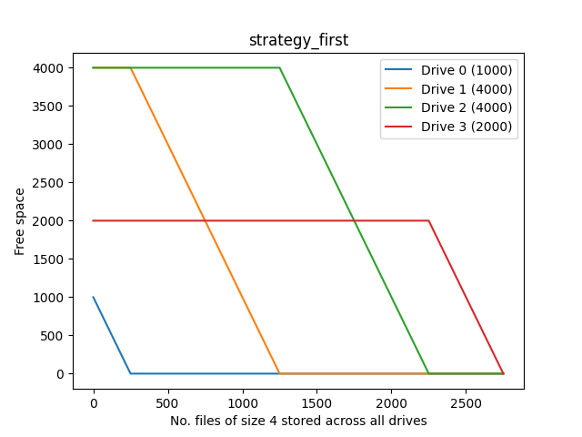
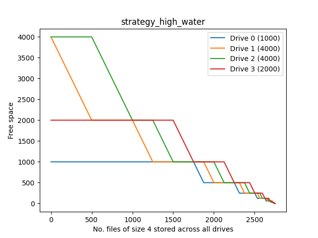
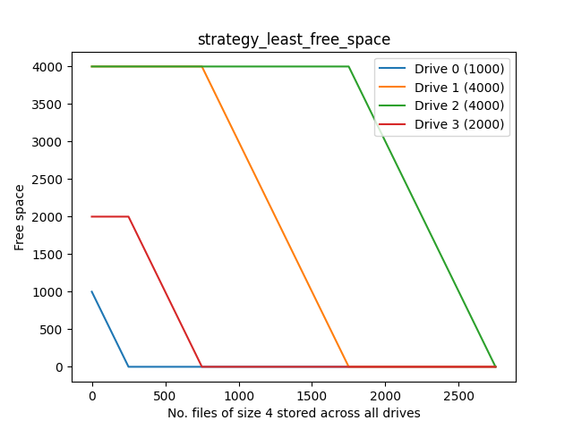
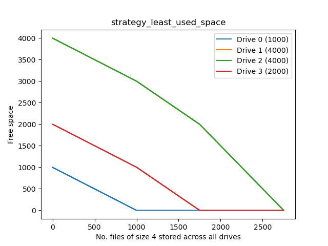
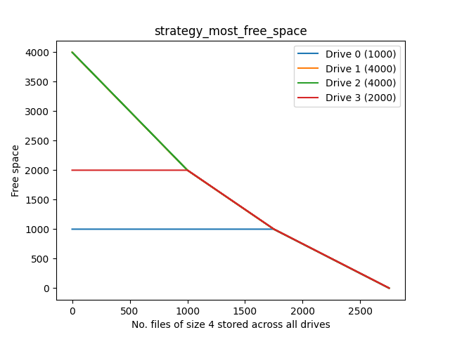
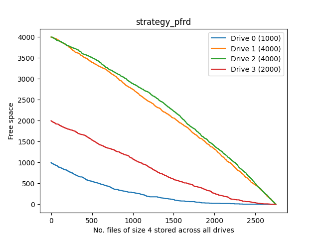
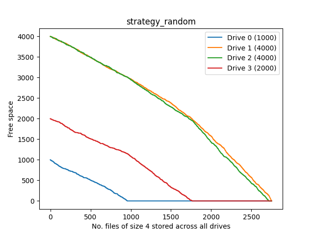

# binpackingsim
Quick script to simulate different online [bin packing](https://en.wikipedia.org/wiki/Bin_packing) strategies (e.g. for writeable [union-mounting](https://en.wikipedia.org/wiki/Union_mount) systems like [Unraid](https://unraid.net/) or [mergerfs](https://github.com/trapexit/mergerfs))

It's very WIP so parameters are hardcoded for the moment. Tk GUI coming eventually

# Strategies

NB: The bin-packing problem on Wikipedia involves bins of equal sizes, making lus and mfs equivalent

| Function name | Name on Wikipedia | Name in Unraid | Name in mergerfs |
| - | - | - | - |
| `strategy_first` | First-Fit? | Fill-up | `ff` (first found) |
| `strategy_high_water` | - | High-water | - |
| `strategy_least_free_space` | Best-Fit? | - | `lfs` (least free space) |
| `strategy_least_used_space` | Worst-Fit? | - | `lus` (least used space) |
| `strategy_most_free_space` | Worst-Fit? | Most-free | `mfs` (most free space) |
| `strategy_pfrd` | - | - | `pfrd` (percentage free random distribution) |
| `strategy_random` | - | - | `rand` (random) |

# Example plots

Scenario: storing 4GB files on a system of (1, 4, 4, 2)TB drives

